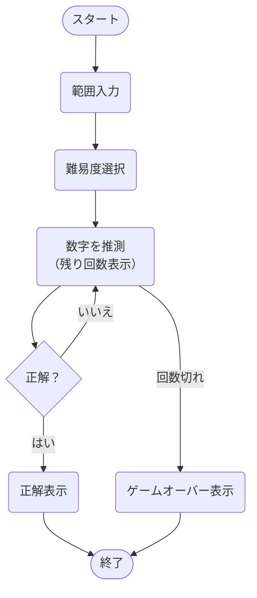
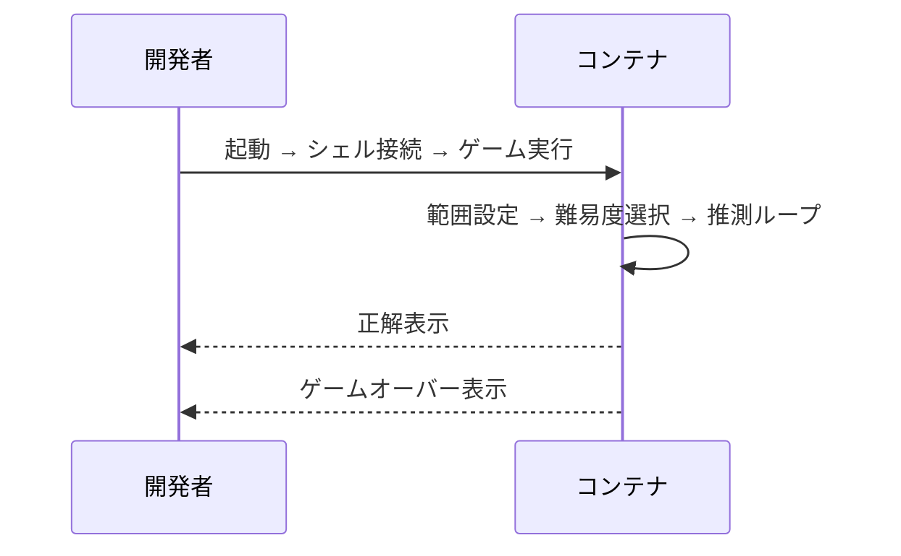

# Number Guess Game


### 数字を推測するゲーム


<br>

## ⭐ デモ画像


### 最小数と最大数を入力し、その中でランダムに選択される数字を選ぶデモ画像

<br>


<br>

## **📝 サービス紹介と導入ガイド**
- [サービスの特徴・開発の目的](#サービスの特徴・開発の目的)

- [セットアップ手順](#セットアップ手順)

- [基本的な使い方](#基本的な使い方)

<br>

## **🛠 技術構成**

- [システム全体の構成図](#システム全体の構成図)

- [使用技術](#使用技術)


<br>

## **📚 出典・ライセンス**

- [参考文献](#参考文献)

- [ライセンス情報](#ライセンス)

<br>

---

## <a id="サービスの特徴・開発の目的"></a> 📝 サービスの特徴・開発の目的

<br>

###  サービスの全体像

- このプロジェクトは、**数字当てゲーム**です。

- 最小数（n）と最大数（m）を入力し、その中でランダムに選択される数字を選びます


<br>

### できること

- **最小値・最大値の入力**  
  
  誤入力時は再入力を促します。

- **難易度選択**  
  
  easy、medium、hard で試行回数（15／10／5回）を設定。

- **インタラクティブな推測ループ**  
  
  「Time : 3/10」など現在の試行数を表示。

- **試行回数内で当てる**  
  
  正解時は「何回目で当てたか」を表示。

- **ゲームオーバー判定**  
  
  回数を使い切ると正解を表示して終了。

<br>

### 作成のきっかけ

1. **課題意識**

   `print()` のバッファリングやバイナリ入出力の仕組みを理解し、技術力を高めたかった。  


2. **解決アプローチ**  

　　`sys.stdout.buffer.write()` と `sys.stdin.buffer.readline()` を組み合わせ、

　　バッファをクリアして即時に出力しつつ高速にユーザー入力を読み取る仕組みを実装した。

   

3. **得られた学び**

   Pythonの出力が遅れる仕組みを理解し、CLIで入力・出力がすぐに反映される方法を身につけた


<br>


---

## <a id="セットアップ手順"></a> 🚀 セットアップ手順

<br>

### 1. 前提条件 

以下を事前にインストールしてください

- [Git](https://git-scm.com/)

- [Docker](https://docs.docker.com/get-docker/)

<br>

### 2. リポジトリのクローン

以下のコマンドをターミナルで実行します

```bash
git clone git@github.com:BackendExplorer/Number-Guess-Game.git
```

```bash
cd Number-Guess-Game
```


<br>

---


## <a id="基本的な使い方"></a>🧑‍💻 基本的な使い方

<br>

### 1. コンテナ起動

Docker Desktopを起動したら、ターミナルを開いて、以下のコマンドでコンテナを起動します。


```bash
docker compose up -d
```

<br>

### 2. シェルでコンテナに入る

起動したコンテナの中にシェルを開いて、操作できる状態にします。

```bash
docker compose exec -it guess-game sh
```

<br>

### 3. ゲームを起動する

シェル内で以下を実行し、数字当てゲームを開始します。

```bash
python main.py
```


<br>

### 2. ユーザーの操作手順

<br>




<br>

---


## <a id="システム全体の構成図"></a>🔄 システム全体の構成図

<br>



<br>


<br>

---

## <a id="使用技術"></a>🧰 使用技術

<br>

### 技術選定の理由

- **`Python`**
  
  豊富な標準ライブラリと高い可読性によって、複雑なシステムを効率的に実装するため
  

- **`Docker`**

  依存関係をコンテナ内に隔離し、環境差異を排除してどこでも同じ動作を保証するため

- **`Docker Compose`**

  サーバコンテナとクライアントコンテナを同時に起動し、起動手順を簡素化するため

<br>

| カテゴリ       | 技術スタック                                                                 |
|----------------|------------------------------------------------------------------------------|
| 開発言語       |  |
| 開発環境       | &nbsp;&nbsp;&nbsp;&nbsp; |
| バージョン管理 | &nbsp;&nbsp;&nbsp;&nbsp; |
| インフラ |   |
| 描画ツール     | &nbsp;&nbsp;&nbsp;&nbsp; |

<br>

---

## <a id="参考文献"></a>📗 参考文献

<br>

### 公式ドキュメント

- [Python 公式ドキュメント](https://docs.python.org/3/)
  
  標準ライブラリの利用方法を参照

- [Docker - コンテナ](https://docs.docker.com/)

  コンテナのビルドと実行手順を参照

- [Docker Compose - サービス定義](https://docs.docker.com/compose/)

  コンテナの起動方法を参照

<br>

---

## <a id="ライセンス"></a>📜 ライセンス情報

<br>

<ul>
  <li>
    本プロジェクトの全コード・構成・図・UIなどの著作権は、制作者である Tenshin Noji に帰属します。<br><br>
    採用選考や個人的な学習を目的とした閲覧・参照は歓迎しますが、<br><br>
    無断転載・複製・商用利用・二次配布は禁止とさせていただきます。<br><br>
    ライセンス全文はリポジトリ内の <a href="./LICENSE.md" target="_blank">LICENSEファイル</a>をご覧ください。
  </li>
</ul>

<br>
